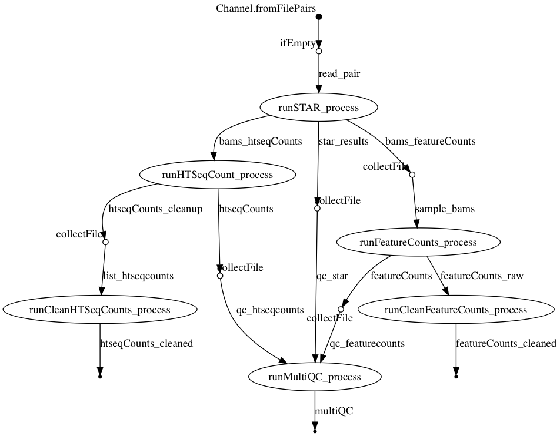

# nf-rnaSeqCount
*nf-rnaSeqCount* is a [Nextflow](http://nextflow.io/) pipeline for obtaining raw read counts for RNA-seq data using a given reference genome and annotation. This pipeline 

<p align="center">
  
</p>

# 1. Pipeline Dependencies
To use the rnaSeqCount pipeline, the following dependencies are required:
### 1.1. Softwares
- [x] [Nextflow](https://www.nextflow.io/)
- [x] [Singularity](http://singularity.lbl.gov/)

### 1.2.  Singularity Containers
- [x] [STAR](https://github.com/alexdobin/STAR) - ```shub://phelelani/nf-rnaSeqCount:star```
- [x] [HTSeq-Counts](https://htseq.readthedocs.io/en/release_0.9.1/overview.html) - ```shub://phelelani/nf-rnaSeqCount:htseqcount```
- [x] [featureCounts](http://subread.sourceforge.net/) - ```shub://phelelani/nf-rnaSeqCount:featurecounts```
- [x] [MultiQC](http://multiqc.info/) - ```shub://phelelani/nf-rnaSeqCount:multiqc```

### 1.3. Reference Genome and Indexes
- [x] Reference Genome (.fa) and Genome Annotation (.gtf) files
- [x] Reference Genome Indexes (```bowtie2``` & ```STAR``` - see *3.* below on how to generate)

# 2. Optaining the ```nf-rnaSeqCount``` pipeline
The ```nf-rnaSeqCount``` pipeline can be obtain using any of the following methods:

### 2.1. Using the ```git``` command:
- [x] ```git clone https://github.com/phelelani/nf-rnaSeqCount.git```

### 2.2. Using the ```nextflow``` command:
- [x] ```nextflow pull phelelani/nf-rnaSeqCount```
- [x] ```nextflow pull https://github.com/phelelani/nf-rnaSeqCount.git```
- [x] ```nextflow clone phelelani/nf-rnaSeqCount <target-dir>```

# 3. Generating genome indexes.
To generate the ```STAR``` and ```bowtie2``` indexes for the reference genome, run the following commands:
### 3.1. ```STAR``` index
```
singularity exec --cleanenv containers/phelelani-rnaSeqCount-master-star.simg STAR \
  --runThreadN 4 \
  --runMode genomeGenerate \
  --genomeDir <> \
  --genomeFastaFiles <>
```

### 3.2. ```bowtie2``` index
```
singularity exec --cleanenv containers/phelelani-rnaSeqCount-master-star.simg bowtie2-build </path/to/genome.fa> </path/to/genome>
```

# 4. Pipeline Execution
The ```nf-rnaSeqCount``` pipeline can be run in one of two ways:

### 4.1. Directly from the command line by supplying the required parameters
```
nextflow run main.nf --data '/path/to/data' --out '/path/to/output' --genome '/path/to/genome.fa' --genes '/path/to/genes.gtf' --index '/path/to/STARIndex'
```
### 4.2. By editing the ```main.nf``` file and specifying the parameters
Edit main.nf:
```
params.data = '/path/to/data'           // Path to where the input data is located (where fastq files are located).
params.out = '/path/to/output'          // Path to where the output should be directed.
params.genes = '/path/to/genes.gtf'     // The genome annotation file
params.genome = '/path/to/genome.fa'    // The whole genome sequence
params.index = '/path/to/STARIndex'     // Path to where the STAR index files are locaded
```

Then run the pipeline:
```
nextflow run main.nf
```

# References
